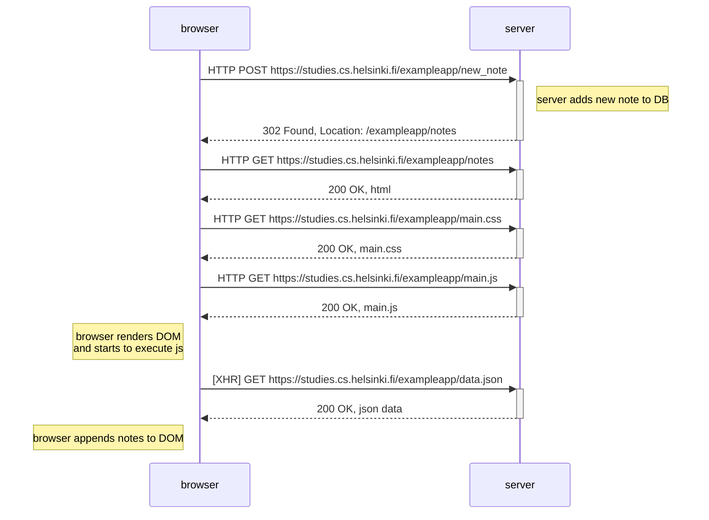

```mermaid
sequenceDiagram
    participant browser
    participant server
    
    browser->>+server: HTTP POST https://studies.cs.helsinki.fi/exampleapp/new_note

    Note right of server: server adds new note to DB

    server-->>-browser: 302 Found, Location: /exampleapp/notes

    browser->>+server: HTTP GET https://studies.cs.helsinki.fi/exampleapp/notes
    server-->>-browser: 200 OK, html

    browser->>+server: HTTP GET https://studies.cs.helsinki.fi/exampleapp/main.css
    server-->>-browser: 200 OK, main.css

    browser->>+server: HTTP GET https://studies.cs.helsinki.fi/exampleapp/main.js
    server-->>-browser: 200 OK, main.js

    Note left of browser: browser renders DOM<br/> and starts to execute js

    browser->>+server: [XHR] GET https://studies.cs.helsinki.fi/exampleapp/data.json

    server-->>-browser: 200 OK, json data

    Note left of browser: browser appends notes to DOM


```